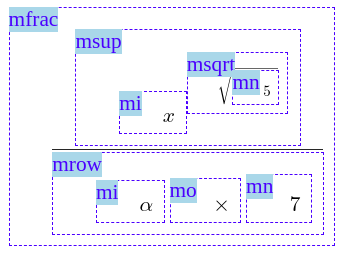
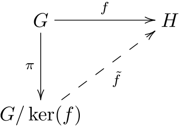
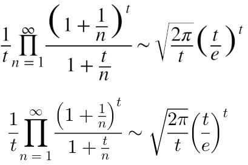
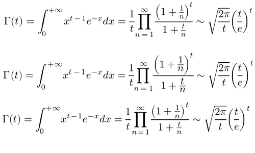

# MathML Core Explainer

**Published**: 2019-10-08, **Updated**: 2019-10-08,
**Draft specification**: [MathML Core](https://mathml-refresh.github.io/mathml-core/)

## Authors:

 * Fred Wang
 * Brian Kardell

## Introduction

[Mathematical notations](https://en.wikipedia.org/wiki/Mathematical_notation)
form a **fundamental aspect of writing systems found in all civilizations**
and have been instrumental for the **diffusion and development of
scientific and technical knowledge**. In agreement to
[W3C TAG's Ethical Web Principles](https://www.w3.org/2001/tag/doc/ethical-web-principles/), we believe it is **important to enable this for the Web** and that
was actually evident from the
[earliest days of the Web at CERN](https://www.w3.org/MarkUp/HTMLPlus/htmlplus_45.html).

**MathML** is the resulting standard for describing
**mathematical notation in DOM**. In addition to HTML5, it has been
**integrated into numerous standards** used in ebooks or office applications.
It can be generated, read or processed via a
**[rich ecosystem of tools](https://www.w3.org/wiki/Math_Tools#Authoring_tools)**
and is **natively rendered by Gecko and WebKit** browsers.
However, the [current recommendation](https://www.w3.org/TR/MathML3/) contains
much that is
speculative, theoretical, not universally implemented, was under adopted, or is
problematic for browsers to implement. Similarly, it came from a different
era of standardization and lacks the current rigors expected for modern Web
platform specifications.

**[MathML Core](https://mathml-refresh.github.io/mathml-core/)**
then is a necessary and rigorous definition of the
**fundamental subset of MathML features** which are widely developed, deployed
and used in practice.  It relies on
**well-established rules from TeX and Microsoft Word**
and focuses on **proper integration into the Web platform**. Combined together,
these features enable
**interoperable, extensible and high-quality mathematical rendering**.

<figure style="max-width: 400px; margin-left: auto; margin-right: auto;">
  
  <figcaption>MathML/DOM for the formula (x^√5)/(α×7).</figcaption>
</figure>

## Goals
* To **provide users with efficient, natural, readable and high-quality rendering of mathematical notations**, consistently with other text they encounter in the browser.

* To **provide authors with native, efficient and interoperable rendering of mathematical notations** that they are able to reason about consistently with the rest of the Web Platform.

* To **rigorously define the necessary subset, how it works and properly integrates into the Web Platform** and ensure testable and interoperable implementations.

* To **establish a productive and agreeable starting point** for additional work and conversation going forward and make it possible to more easily explore more, consistently with the rest of the platform.

## Non-Goals

* To **fundamentally change or challenge MathML's basic premises**.
  Effort is made to keep backward compatibility for existing MathML3 content.

* To **provide an exhaustive list of elements and attributes** for existing
  mathematical notations. MathML Core only provides the base layer on which
  one can define more advanced notations.

* To **provide a self-contained solution to problems ultimately better explored through another area of the platform**.
  MathML Core relies as much as possible on existing Web Platform
  features and provides a platform-aligned starting point to solve more
  problems. Examples include, but are not limited to:
  - **Specific elements or attributes for styling** which
    are better described by existing or new CSS features.
  - **Complete and explicit description of semantics** which are better
    described by extending ARIA.
  - **Open-ended elements to allow implementation-specific features**
    instead of standard techniques for customizations and extensions.
  - **Native support for editing, interaction, exploration, simple input
      syntax** or other advanced features that are better handled by
      DOM/JavaScript and math libraries.
  - **Complex graphical layout** which can instead be
    performed by embedding MathML in HTML/CSS or SVG.
    <figure style="max-width: 400px; margin-left: auto; margin-right: auto;">
     
    <figcaption>
       Formulas in a commutative diagram.
    </figcaption></figure>

* To **fully explain mathematical rendering via as-yet-to-be-defined low-level
  primitives**.
  Rather, these serve as inputs to their possible definition and provide
  valuable insight into needs.

## Design Discussion

### Not reinventing the wheel

* As explained in the introduction, MathML is already integrated into
  numerous standards and shipped in two Web engines.
  Consequently, **a new format to replace MathML would be a drastic
  change of direction** and a source of backward compatibility and
  interoperability issues.

* For a native mathematical rendering to be possible, it
  **must adhere to modern browser designs** and a significant effort is being
  made to ensure that MathML Core achieves that goal. For example, all browsers
  use internal tree structures, follow CSS invariants or try to keep code
  size minimal to facilitate security, maintenance, testing, etc

* One **must not duplicate existing Web Platform features**.
  As explained in the non-goals section, MathML Core tries to rely as much as
  possible on existing Web Platform concepts from HTML5 or CSS to describe
  its implementation. Non-fundamental mathematical features that can be
  easily replaced with polyfills or extensions are removed.

* Rendering of mathematical formulas **follow well-established
  rendering rules from TeX and OpenType** which are integrated into MathML
  Core.
  A naive box layout would be enough to get interoperable rendering but is
  likely to
  lead to poor spacing, placement or text rendering inside mathematical
  formulas.

    <figure style="max-width: 400px; margin-left: auto; margin-right: auto;">
     
    <figcaption>
     Top: Chrome 23 using MathML3 rules and internal heuristics ;
     Bottom: Igalia's Chromium build using only MathML Core rules.
    </figcaption>
    </figure>

### Applying Extensible Web principles

The biggest design decisions centered on how to apply Extensible Web principles
in our own work, as MathML sits in a very unique place in history, and how it
"fits" into the platform.  Not only does it have **existing implementations,
very wide adoption and expectations and integration through the
HTML parser**, but we are approaching it while standards
that in the future might theoretically expose the magic for mathematical
layout, such as
**the CSS Layout API and related Houdini standards, are still developing and significantly in flux**.

In order to balance all of this we decided on the following:

* **Normalize the DOM**.  Because of when and how it was defined, MathML in all
  browsers was exposed to the DOM (in all browsers, through the parser) as
  simply `Element` which is unpredictable and fundamentally limiting for the
  application of any real Extensible Web ideas.  Doing so, however, allows that
  all of our principles and separations (for example ARIA, AOM, Houdini, etc)
  can move forward in tandem.

* **Acknowledge that minimal math magic exists in the platform already in two
  browsers**.
  Our goal then is to keep it minimal and carefully develop what serves as
  useful input to the ultimate definition of Houdini APIs.

* **Increase compatibility with CSS**. We provide a design
  compatible with CSS layout and describe how CSS properties are interpreted,
  so that authors can reliably use them to customize math layout.

* Where possible, **attempt to expose information to authors** which would be
  necessary in polyfilling, libraries or extending the platform through platform
  consistent mechanisms.

<figure style="max-width: 400px; margin-left: auto; margin-right: auto;">
  <pre><code>
  &lt;style&gt;
  math {
     font-family: STIX Two Math;
     color: blue;
  }
  mfrac {
     border: 1px solid dotted;
     padding: 1em;
  }
  .myFancyMathLayout {
     display: layout(myFancyMathLayout);
  }
  &lt;/style&gt;
  &lt;math&gt;
    &lt;mfrac&gt;
      &lt;mrow class="myFancyScriptedElement"&gt;
        ...
      &lt;/mrow&gt;
      &lt;mrow onclick="myInteractiveAction()"&gt;
        ...
      &lt;/mrow&gt;
    &lt;/mfrac&gt;
  &lt;/math&gt;
  </code></pre>
  <figcaption>
     Example of using CSS, JavaScript or the Layout API to enhance
     MathML Core with user-defined features.
  </figcaption>
</figure>

## Considered Alternatives

### Abandon MathML in favor some new thing

There are numerous criticisms of MathML.  Like all aspects of the existing
platform, for example, **more succinct forms of expression exist that many
authors are more comfortable writing** (e.g. linear text syntax used in LaTeX or
[Computer algebra systems](https://en.wikipedia.org/wiki/Computer_algebra_system)).
Like other aspects of the platform, it is also possible to be **more semantic
than MathML currently provides**.

A few things don't change though and among them is the difficulty in rendering
interoperable mathematical formulas with good quality.
**Abandoning MathML would be a rejection of an entire ecosystem and decades of
work in standardization and advancement** with little hope that any of the
current state would change in any reasonable timeframe.
This would be tragic as we don't generally require that authors use complex
libraries in order to layout text, or recommend that they be inserted as images.
We believe that **getting native math rendering
is the right thing to do**. From that starting point,
**building atop additional semantics, extensions, conversions and further
explorations** becomes very plausible.

<figure style="max-width: 400px; margin-left: auto; margin-right: auto;">
  <pre><code>&lt;la-tex&gt;
  {\Gamma(t)}
  = {\int_{0}^{+\infty} x^{t-1} e^{-x} dx}
  = {\frac{1}{t}
     \prod_{n=1}^\infty
     \frac{\left(1+\frac{1}{n}\right)^t}{1+\frac{t}{n}}}
  \sim {\sqrt{\frac{2\pi}{t}} \left(\frac{t}{e}\right)^t}
&lt;/la-tex&gt;
  </code></pre>
  
  <figcaption>
  LaTeX source in a <a href="https://fred-wang.github.io/TeXZilla/examples/customElement.html">custom element</a> and its shadow MathML rendered with
  the <a href="http://www.gust.org.pl/projects/e-foundry/lm-math">Latin Modern Math font</a> ; From top to bottom:
    Blink (Igalia's build), WebKit (r249360) and Gecko (Firefox 68)
  </figcaption>
</figure>

### Focus instead solely on lacking primitives

A big part of the challenge of focusing on lacking primitives is that
**it leaves open the question of what is lacking**.  The main proposals here of
things to focus on have to do with additional semantics, 'stretchy characters'
and complex alignments.  While we agree that these are all excellent goals, we
believe that they are also very independently pursuable, and that both causes
are boosted by doing so.

However, without also providing a detailed
layout specification, pursuing native rendering in all browsers or
performing interoperability
tests it becomes very **hard to design a full browser-compatible math rendering
implementation and to introduce necessary web platform
primitives**. Thus we again relegate
ourselves to the current state of one of the hardest problems in a way that we
don't for other forms of text.

### Enhance MathML3 but keep all or most features

Another approach would be to integrate the TeX/OpenType and HTML5/CSS
improvements but at the same time preserving all or most features from MathML3.
We discarded this approach for several reasons:

* **Some MathML3 features don't integrate well within the web platform**
  and it is not clear how to keep them and at the same time try to align MathML
  with browser design. **Other features duplicate existing web platform
  primitives without re-using them**.
  As explained in section "Not reinventing the wheel", these are strong blockers
  to get new features accepted. Indeed, many of these have never been
  implemented in browsers or have been removed.

* **Some MathML3 features have very low or almost null usage**.
  This means it is very
  difficult to justify effort for implementing them natively and maintaining
  them while the rest of the codebase evolves.
  Instead, we prefer to focus on a small subset that is used in practice, and
  in agreement with Extensible Web principles, add the necessary APIs to let
  users build extension on top of MathML Core.

* **MathML3 has many features, is underspecified, lacks automated tests and is
  only partially implemented in browsers**. This means that keeping all the
  features and at the same time achieving interoperability would require a huge
  effort. Again, the choice was instead to consider a subset of manageable size,
  corresponding to what is used on web pages and implemented in two WebKit and
  Gecko.

## Stakeholder Feedback

* ...
* ...
* ...
